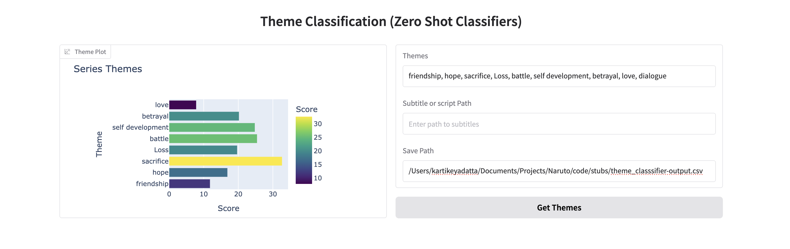
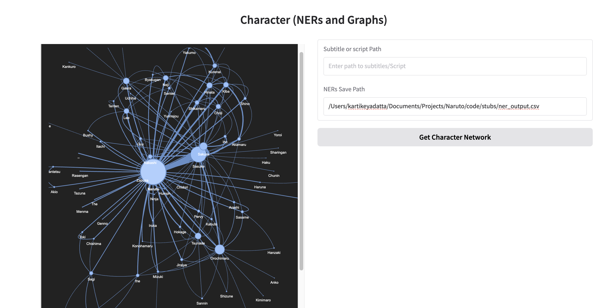

- In this I will Develop a website using different features and technolagies I have laerned to create a universe of one my favourite anime namely naruto.

## Theme Analysis Process in the jupyter notebook:

* **Model Loading and Setup:**
    * The  model was loaded for zero-shot classification, configured for PyTorch and to run on a GPU if available. (I have used google colab for GPU powered tasks😄)
    * A list of themes (`theme_list`) was defined for the classification task.
    * A test classification was performed on a sample sentence to ensure the model was working.
* **Subtitle Data Processing:**
    * Subtitle files were loaded from the `../data/Subtitles/` directory.
    * The subtitle data was cleaned, removing header information and formatting characters.
    * The cleaned dialogue was concatenated into single strings for each episode.
    * The episode number was also extracted from each file name.
    * The data was then loaded into a pandas DataFrame.
* **Sentence Batching:**
    * The dialogue for each episode was split into sentences using NLTK's `sent_tokenize`.
    * To accommodate the model's token limit, sentences were grouped into batches of 20.
* **Theme Inference:**
    * The zero-shot classification model was applied to each batch of sentences.
    * The model's output (theme scores) was aggregated and averaged to produce a thematic profile for each episode.
* **DataFrame Enrichment:**
    * The resulting theme data was then added to the original DataFrame, to create a DataFrame that contained both the original subtitle data and the theme classification data.

- **I am going to use Gradio for creating an interactive demo of the model.**
- I am using gradio to make a visuyal representation of the themes I want to choose and the inference of our model on the selected themes based on our subtitles. 
- I have provided witht three text fields to enter namely themes, Subtitles and the path to save our file.
- Using the data we will plot a Bar-Graph of all the themes to be visualised and their score based on the output of zero-shot classifier. 
_ The sample themes I have picked are friendship, hope, sacrifice, Loss, battle, self development, betrayal, love, dialogue. with a subtitle script path /Users/kartikeyadatta/Documents/Projects/Naruto/code/data/Subtitles anssd I saved my file to /Users/kartikeyadatta/Documents/Projects/Naruto/code/stubs/theme_classifier_output.csv

- I have used the GPU of google colab to compute my theme classification outputnand stored it in the stubs folder to save the current data and use it to represenrt the theme classsification.

- **Creation of Named Entity Recognition**

- Loaded the spaCy transformer model ("en_core_web_trf") to perform NER on the script dataset.

- Extracted person names ("PERSON" label) and store first names in a set to avoid duplicates.

-  Character Network Generation

- Created a sliding window over sentences (size 10) to establish relationships based on character proximity.

- Stored relationships in a DataFrame and aggregate connections.

- Visualized the character network using NetworkX and PyVis, generating an interactive HTML graph.

**Output**

- The output is a dynamic, interactive network graph (naruto.html) showing character relationships based on script proximity.

- Have succesfully create a network of connection between characters in the naruto series.

- Here is a visualisation of the Character relation graph based on their interaction in the subtitles.

- **Now am gaing to create a jutsu classification to refere to.**

- Simplified the jutsu classification to the major three, which is **Ninjutsu** **Taijutsu** and **Genjutsu**.

- cleaned the data and removed any noise from the json file if there any.

- Tokenized the input for the model to implemet using preprocessing from scikit-learn.

- I split the data into training and testing sets.

- Shall  be using  model for my tokenisation and fed forwarn to the nueral network.

- Defined a preprocessing function to handle text input efficiently.

- Converted Pandas DataFrames to Hugging Face Datasets and applied the tokenizer to the datasets for model readiness.

- Got class weights to penalise the less data more as the data is more squed towards ninjutsu.

- Created a training_utils module to compute class weights and evaluation metrics, improving model robustness and evaluation.

- Implemented a CustomTrainer class by extending Hugging Face’s Trainer to incorporate custom loss functions with class weighting, ensuring better learning from underrepresented classes.

- **🍥 Naruto-Themed Character Chatbot using Meta-Llama-3-8B-Instruct**
- The Naruto Character Chatbot! 

- This section of the project brings one of my favorite anime character, Naruto Uzumaki, to life using a fine-tuned large language model — Meta-Llama-3-8B-Instruct. Built using Hugging Face Transformers, PEFT (LoRA), Gradio, and various NLP techniques, the chatbot captures Naruto’s unique personality, speech patterns, and iconic attitude for interactive conversations.

- This chatbot:

    1. Uses Meta-Llama-3-8B-Instruct as the base model.

    2. Is fine-tuned with real Naruto anime transcripts focused on Naruto’s dialogue.

    3. Can chat with users while mimicking Naruto’s way of speaking.

    4. Is integrated into a Gradio-based interactive web interface alongside other NLP features like theme classification, NER character network generation, and jutsu text classification.

How It Works
1. Dataset Preparation
Loaded dialogue transcripts from naruto.csv.

Filtered for meaningful Naruto responses (5+ words).

Cleaned dialogue by removing parentheticals like (sighs) and action tags.

Created a training dataset with prompts formatted in-character.

2. Model Training
Used Meta-Llama-3-8B-Instruct as the base model.

Applied LoRA (Low-Rank Adaptation) for parameter-efficient fine-tuning.

Used BitsAndBytes 4-bit quantization to reduce GPU memory usage.

Trained for a few hundred steps using SFTTrainer from TRL (Transformers Reinforcement Learning).

3. Model Deployment
Saved and pushed the fine-tuned model and tokenizer to Hugging Face Hub:

4. Chat Inference
The chatbot reconstructs the chat history and uses a system prompt for personality enforcement.

Generates character-consistent responses using text generation pipeline.

5. Web App Integration (Gradio)
Built a complete Gradio interface with:

Theme Classification using Zero-Shot NLP (facebook/bart-large-mnli)

Named Entity Recognition + Character Relationship Graph

Jutsu Text Classification

Naruto Chatbot Interface

# Improving Model Chat Performance

Here's a plan to enhance the chat performance of the model:

## Immediate Actions (✅ Do Now)

* **Switch from pipeline to `model.generate()`:** Directly using the `model.generate()` method offers more fine-grained control over the generation process, potentially leading to more efficient inference.

* **Reduce `max_new_tokens`:** Limiting the maximum number of newly generated tokens can significantly reduce latency, especially for shorter responses. Experiment with different values to find a good balance between speed and response length.

* **Cache tokenizer and system prompt:** Pre-loading and caching the tokenizer and the system prompt (if it's consistent) can save processing time for each new interaction.

## Optional Optimizations (🔧 Optional)

* **Compile with `torch.compile()`:** Utilizing `torch.compile()` (if applicable to your model and environment) can optimize the model's execution graph for faster inference.

* **Distill to smaller model:** If latency is a critical concern, consider distilling the current model into a smaller, more efficient architecture. This often involves a trade-off in model size and potentially some accuracy.

* **Serve via FastAPI + ONNX:** Deploying the model using a high-performance web framework like FastAPI and converting the model to ONNX (Open Neural Network Exchange) format can lead to significant speed improvements and better resource utilization in a production setting.

This README outlines the steps being considered to optimize the model's chat performance. The "Do Now" actions will be implemented immediately, while the "Optional" optimizations will be explored based on the initial performance improvements and resource constraints.